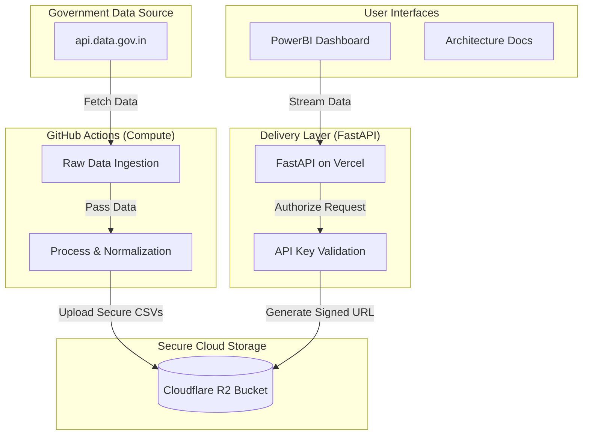

# UIDAI Aadhaar Intelligence Engine

[](https://github.com/sreecharan-desu/uidai-analytics-engine/actions/workflows/monthly-raw-download.yml)
[](https://github.com/sreecharan-desu/uidai-analytics-engine/actions/workflows/monthly-clean-processing.yml)


> **UIDAI DATA HACKATHON 2026**
> *Transforming raw Aadhaar enrolment and update data into a clean, consistent, and policy-ready dataset.*

## Stateless Architecture Overview

Sanchara Intelligence uses a **Secure Cloud Storage** architecture. The system leverages **Cloudflare R2** (S3-compatible) as a private, high-performance storage layer, ensuring data is accessible only via authenticated API requests.



## Key Innovation: Secure Cloud Storage & Signed Delivery
Traditional analytics engines struggle with balancing public access and data security. This project solves this by using **Cloudflare R2 with Presigned URLs**:
1.  **Private-by-Default**: Detailed CSV datasets are stored in a private R2 bucket, inaccessible to the public internet.
2.  **Ephemerally Public**: The FastAPI layer validates a user's `API_KEY` and generates a temporary, cryptographically signed URL (valid for 1 hour) that allows direct high-speed download from the edge.
3.  **Serverless & Cost-Effective**: We avoid expensive database instances while maintaining strict access control.

## Repository Structure

```
├── app/
│   ├── api/            # FastAPI Endpoint definitions
│   ├── core/           # Security and configuration settings
│   └── main.py         # Application entrypoint & routing
├── public/
│   ├── dashboard.html  # Minimalist research-lab dashboard
│   ├── docs.html       # Sanchara-themed architecture documentation
│   └── og-image.png    # Premium social share branding
├── scripts/
│   ├── download_full_data.py  # High-throughput ingestion script
│   └── process_data.py        # Complex geographic normalization logic
├── .github/workflows/
│   ├── monthly-raw-download.yml
│   └── monthly-clean-processing.yml
└── vercel.json         # Serverless deployment configuration
```

## Technology Stack

| Layer | Technology | Purpose |
| :--- | :--- | :--- |
| **Backend** | `FastAPI` (Python 3.11) | High-performance asynchronous delivery. |
| **Compute** | `GitHub Actions` | Serverless ETL workers triggered by cron/events. |
| **Data** | `Pandas` | Vectorized geographic conflict resolution. |
| **Storage** | `Cloudflare R2` | Private, S3-compatible object storage with Zero Egress fees. |
| **Frontend** | `PowerBI` | Advanced demographic visualizations & trend prediction. |
| **Container** | `Docker` | Ensuring consistent environments across development and production. |
| **Analytics** | `Vercel Analytics` | Performance and engagement monitoring. |

## Getting Started

### Prerequisites
- Python 3.11+
- GitHub Token (with Release permissions)
- `DATA_GOV_API_KEY` (from api.data.gov.in)

### Local Development
1. **Setup Environment**:
   ```bash
   pip install -r requirements.txt
   ```
2. **Run API**:
   ```bash
   uvicorn app.main:app --reload
   ```
   Access the dashboard at `http://localhost:8000/dashboard`.

### Docker Deployment
1. **Build and Run**:
   ```bash
   docker-compose up --build
   ```
2. **Run in Background**:
   ```bash
   docker-compose up -d
   ```
   The API will be available at `http://localhost:8000`.

---

<p align="center">
  Built with dedication for India's Digital Infrastructure
</p>
