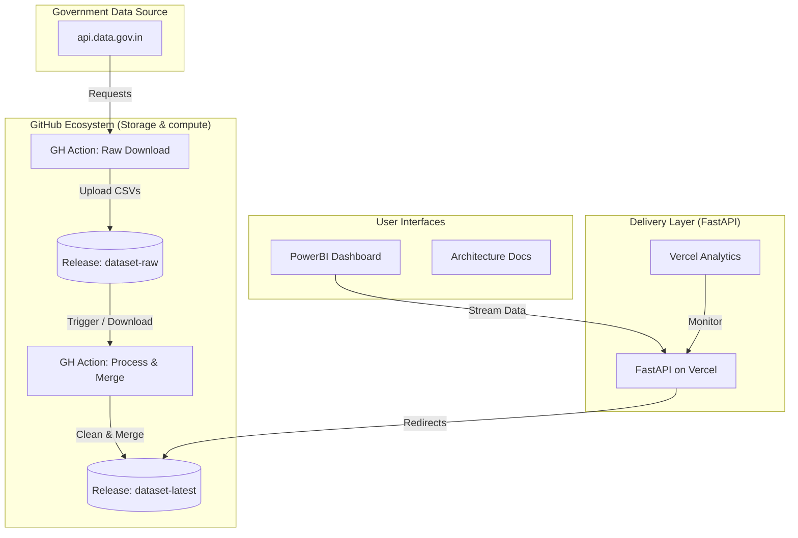

# UIDAI Aadhaar Intelligence Engine

[](https://github.com/sreecharan-desu/uidai-analytics-engine/actions/workflows/monthly-raw-download.yml)
[](https://github.com/sreecharan-desu/uidai-analytics-engine/actions/workflows/monthly-clean-processing.yml)


> **UIDAI DATA HACKATHON 2026**
> *Transforming raw Aadhaar enrolment and update data into a clean, consistent, and policy-ready dataset.*

## Stateless Architecture Overview

Sanchara Intelligence uses a **Release-as-Database** (RaD) architecture. Instead of maintaining a persistent database server, the system leverages GitHub Releases as a highly available, versioned, and globally distributed storage layer.



## Key Innovation: Release-as-Database
Traditional analytics engines rely on expensive RDS or NoSQL instances. This project eliminates that overhead by treating **GitHub Release Assets** as read-only DB tables:
1. **Parallel Ingestion**: Multi-threaded Python workers fetch chunked data (1M+ rows) with exponential backoff.
2. **Schema-on-Write**: Cleaning logic resolves district-state conflicts and administrative boundary changes *before* publishing.
3. **CDN Redirection**: FastAPI acts as a lightweight proxy, performing logic-check redirections (307) so that visualization engines pull data directly from GitHub's infrastructure.

## Repository Structure

```
├── app/
│   ├── api/            # FastAPI Endpoint definitions
│   ├── core/           # Security and configuration settings
│   └── main.py         # Application entrypoint & routing
├── public/
│   ├── dashboard.html  # Minimalist research-lab dashboard
│   ├── docs.html       # Sanchara-themed architecture documentation
│   └── og-image.png    # Premium social share branding
├── scripts/
│   ├── download_full_data.py  # High-throughput ingestion script
│   └── process_data.py        # Complex geographic normalization logic
├── .github/workflows/
│   ├── monthly-raw-download.yml
│   └── monthly-clean-processing.yml
└── vercel.json         # Serverless deployment configuration
```

## Technology Stack

| Layer | Technology | Purpose |
| :--- | :--- | :--- |
| **Backend** | `FastAPI` (Python 3.11) | High-performance asynchronous delivery. |
| **Compute** | `GitHub Actions` | Serverless ETL workers triggered by cron/events. |
| **Data** | `Pandas` | Vectorized geographic conflict resolution. |
| **Storage** | `GitHub Releases` | Globally distributed storage for 500MB+ CSVs. |
| **Frontend** | `PowerBI` | Advanced demographic visualizations & trend prediction. |
| **Container** | `Docker` | Ensuring consistent environments across development and production. |
| **Analytics** | `Vercel Analytics` | Performance and engagement monitoring. |

## Getting Started

### Prerequisites
- Python 3.11+
- GitHub Token (with Release permissions)
- `DATA_GOV_API_KEY` (from api.data.gov.in)

### Local Development
1. **Setup Environment**:
   ```bash
   pip install -r requirements.txt
   ```
2. **Run API**:
   ```bash
   uvicorn app.main:app --reload
   ```
   Access the dashboard at `http://localhost:8000/dashboard`.

### Docker Deployment
1. **Build and Run**:
   ```bash
   docker-compose up --build
   ```
2. **Run in Background**:
   ```bash
   docker-compose up -d
   ```
   The API will be available at `http://localhost:8000`.

---

<p align="center">
  Built with dedication for India's Digital Infrastructure
</p>
